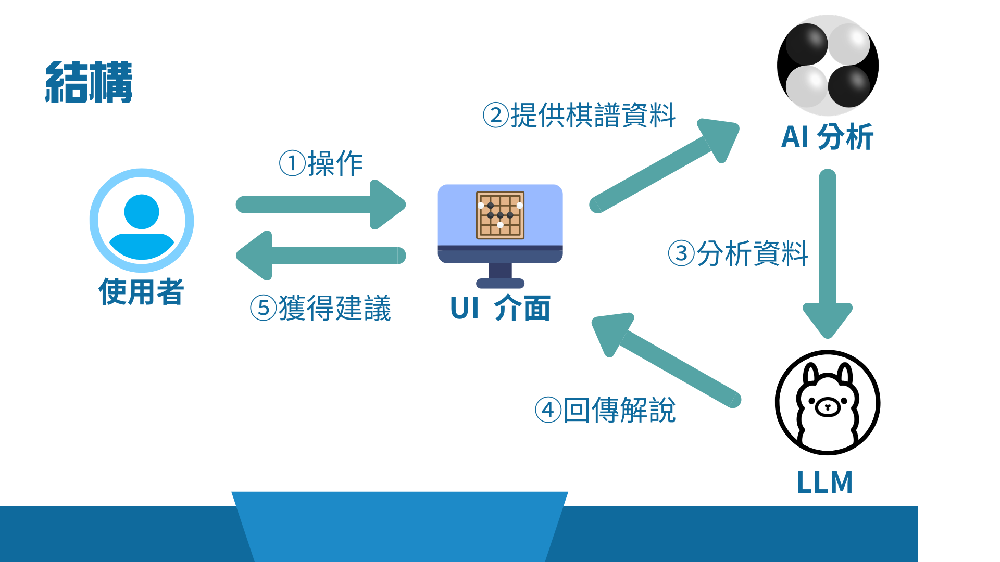

# AI 圍棋老師 / AI Go Teacher
[中文](#中文)

---

## 中文
## 介紹
大家好我是潘昱昕。 **AI 圍棋老師**是我的自主學習專題，此 **Repositories** 涵蓋 **AI 圍棋老師**原始碼，歡迎大家參考。

## 動機

從小在學棋時有接觸過圍棋 AI ，但因為沒有中文的介面與安裝說明，加上當時完全對程式語言一無所知，導致在前置作業處處碰壁。最後找不到解決方法只好放棄。

上高中後因為從社團學習了程式語言加上有語言模型可以提供執導，才終於能成功運行應用程式。而此時我想到如果我可以自己做一個應用程式是不是就可以更方便了。

## 目標

我的目標是製作出一個互動式應用程式— AI 圍棋老師。透過將 AI 分析的資料傳給 LLM 使其生成解說，讓使用者可以輕鬆覆盤，並且能夠自由設定適合自己的模式。

## 架構

## UI 介面
我使用 tkinter 模組生成棋盤，使用者藉由點擊棋盤落子，形成棋譜資訊。

得到 LLM 生成的解說後，解說顯示在  UI 介面上，供使用者參考。

## LLM 
大型語言模型（Large Language Model）是指像是 ChatGPT 、 Gemini 等語言模型。在我的應用程式中負責將勝率等資料轉化成淺顯易懂的解說供使用者參考。

得到勝率變化與最佳著手後，會將資料餵給 LLM ，生成使用者讀的懂的解說。使用者可以依據需求與喜好設定要使用的  LLM 。總共支援 3 種模型來源。

### Ollama
Ollama 是我最主要使用的本地語言模型，可以離線操作，也沒有使用次數限制。只要安裝好  Ollama 以及要使用的模型就可以串接。

### Nvidia Models
Nvidia 在不久之前提供的微型服務，可以利用 API 串接很多語言模型，而且使用次數很多不會很常耗盡。

### Github Models
為開發者測試比較模型的服務，有提供  GPT-4o 等強大模型的 API  。原本打算主要使用  Github Models ，但缺點是  token 數較少，因此現在主要使用  Ollama。

## 參考資料

lightvector.（2025）. *Analysis_Engine.md* [Markdown file]. GitHub. https://github.com/lightvector/KataGo/blob/master/docs/Analysis_Engine.md

GitHub, Inc.（n.d.）. *GitHub Models* [Documentation page]. GitHub Docs. https://docs.github.com/en/github-models

LLM APIs.（n.d.）. NVIDIA. 
https://docs.api.nvidia.com/nim/reference/llm-apis

Ollama’s Documentation.（n.d.）. Ollama. 
https://docs.ollama.com/